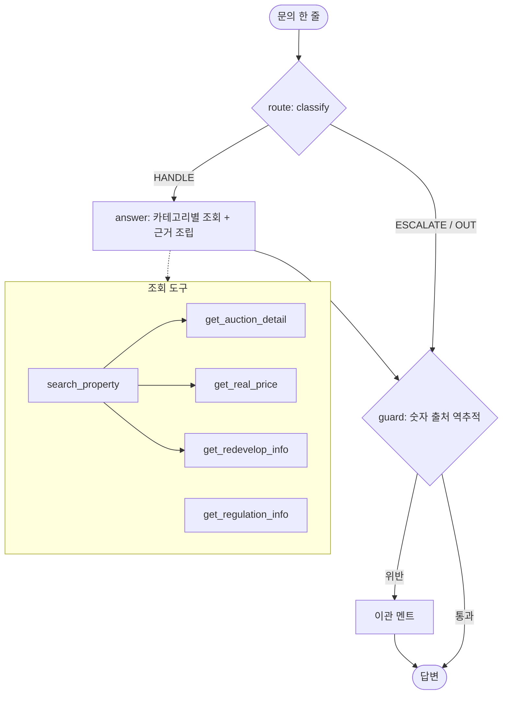

# REPORT — 부동산 안내 라우팅 에이전트

## 1. 주제와 근거 문서: 무엇을 골랐고 왜 골랐는지

- **주제: 부동산 안내 (경매·시세·정비사업·규제)**. 별도로 운영 중인 부동산 서비스를
  도메인 참고로 삼았고, 맛집은 과거 자료라 근거가 약했다.
  반면 부동산은 실거래가·경매·정비사업·용도지역·규제라는 실제 안내 항목이 그대로
  카테고리로 이어져 도메인 근거가 탄탄했다.
- **근거 문서: `docs/policy_matjip.md` → `docs/policy_estate.md`로 교체 작성** (0~7장 + 부록).
  핵심 원칙 '모르는 것은 모른다고 적는다'를 0장에 못 박았다. 금액을 지어내면 이용자가
  입찰가·매매가를 잘못 정하기 때문이다.
- 세 조건 확인: ① 카테고리 4+1개로 답 내용이 다름 ② 장별로 나눌 만큼 충분히 김
  ③ 문서에 없는데 그럴듯하게 답할 수 있는 질문이 있음 (명도·낙찰가 예측·투자 자문 → 검증 필요).

## 2. 카테고리 설계

| 카테고리 | 정의 | 근거 문서 연결 (매핑표) |
|---|---|---|
| AUCTION | 경매 물건의 감정가·최저가·기일·보증금 | 2장 경매 안내 규정 |
| PRICE | 실거래가·전세가 (과거 거래 사실만) | 3장 시세 안내 규정 |
| REDEVELOP | 정비사업 구역의 진행 단계·위치 | 4장 정비사업 안내 규정 |
| REGULATION | 용도지역·용적률·건폐율·허가구역 | 5장 규제 안내 규정 |
| OUT_OF_SCOPE | 맛집·대출·투자추천·수익예측·일반상식 | 7장 범위 밖 안내 |
| (공통) | — | 0장 쓰는 법 · 1장 카테고리 정의 · 6장 검증/이관 (항상 포함) |

- 나눈 근거: 처리 방식이 다르다 (금액 조회 / 거래 조회 / 단계 조회 / 수치 조회 / 이관).
  `context.py`의 `SECTION_MAP`이 이 매핑을 그대로 구현하며, 카테고리별 필요 장만 프롬프트에 넣는다.
- 분류(판정)와 이관 판단(게이트)을 분리했다: `classify`는 카테고리만, `gate`는
  확신도<0.5 → ESCALATE, OUT_OF_SCOPE → 범위밖을 정한다.

## 3. 평가셋 설계

- `data/eval_set.csv` 16건: 카테고리별 3건 + 범위밖 4건…이 아니라 균등 분배
  (AUCTION 3, PRICE 3, REDEVELOP 3, REGULATION 3, OUT 4) 중 6건 fewshot / 10건 eval.
- `data/answer_gold.json` 10건: 문항마다 기대 도구·반드시 담을 사실(must)·말하면 안 되는 것(forbid).
  - 기대 도구: 근거를 안 읽은 것(미호출)·관련 없는 조회·넘겨야 하는데 지어낸 것이 exact-match 하나로 걸린다.
  - must: DB 값 그대로 (예: `840,000,000`, `관리처분인가`). forbid: 문서 안 읽었을 때 나오기 쉬운
    그럴듯한 오답 (예: `낙찰`, `오를 것`, `허가구역입니다`, 미등록 단정 `가능합니다`).
  - 문서에 답이 없는 문의 3건: E2(미등록 사건번호 → ASK), E3(명도 → ESCALATE), E7(미등록 구역 → ASK).
    넘기기 경로(E3·E9)를 잴 수 있게 했다.
- fewshot 6건은 `prompts.py` LLM 지침의 예시 풀로만 쓰고 채점에는 쓰지 않는다 (평가 오염 방지).

## 4. 측정 결과

- baseline (`python evaluate.py`): **판정 정확도 1.000 (12/12), macro F1 1.000,
  도구 적절성 100%, 답변 적절성 100%, 채점기 자기검증 12/12 통과**.
- 혼동 행렬 (행=정답, 열=예측): 대각선 AUCTION 3 · PRICE 4 · REDEVELOP 2 · REGULATION 2 ·
  OUT_OF_SCOPE 1, 비대각 전부 0. 카테고리별 F1이 모두 1.0이라 macro 평균도 1.000이다.
- 정직한 한계: 평가셋이 10건으로 작고 규칙 기반이라 세트 내 100%는 당연하다.
  그래서 표현 변형 흔들기 6건을 돌려 진짜 결함을 찾았다 (아래 개선표).
- 틀린 건 원인 분류 (흔들기에서 발견, 전부 수정 후 재측정):

| # | 바꾼 것 | 판정 | 도구 | 답변 | 메모 |
|---|---|---|---|---|---|
| 0 | 그대로 | 1.000 | 100% | 100% | 기준선 |
| 1 | AUCTION을 PRICE보다 먼저 검사 + 전세/월세/낙찰 패턴 추가 | 1.000 | 100% | 100% | "래미안 전세" ESCALATE→정답, "최저매각가격"의 "가격" 오분류 방지 |
| 2 | 구역명 약칭 매칭 (개포주공→개포주공1단지) | 1.000 | 100% | 100% | "개포주공 언제 입주해?" ASK→정답 |
| 3 | 미등록 사건번호 되묻기 문구에서 예시 숫자 제거 | 1.000 | 100% | 100% | 예시 `2025타경12345`가 가드레일 오탐 유발 → 문구 수정으로 해결 |
| 4 | 미등록 규제 지역 되묻기 분기 + 합정동 규제(G03) DB 보강 | 1.000 | 100% | 100% | `get_regulation_info` 에러 KeyError 수정 |
| 5 | 실거래가 시범 연결 (서울시 공개자료 스냅샷) | 1.000 | 100% | 100% | 목 DB 무응답 동(응암·화곡) 2건이 ANSWER로 전환. E11·E12 추가로 평가셋 12건 |

- 흔들기 최종 6건 전부 정상: 약칭 사건번호(타경 12345) → 정답 / 전세 약칭 → 정답 /
  입주 질문 → 예상 준공까지만(확정 단정 없음) / 미등록 지역 → 되묻기 / 투자 → 범위밖 / 낙찰가 → 읽고 이관.

## 5. 파이프라인 구조도

- 상태(`GraphState`): question · route · confidence · action(HANDLE/ASK/ANSWER/ESCALATE/OUT_OF_SCOPE)
  · tools · results · answer · guardrail_ok.
- `node_answer`에서 행동(ASK/ESCALATE/OUT)이 정해지고, `node_guard`는 ANSWER만 검증한다.
  검증 위반 시 재생성 없이 즉시 이관한다 (재생성은 근거 없는 숫자를 고칠 수 없다는 판단).

## 6. 데모 설계

- `python app.py` → http://localhost:8000. stdlib `http.server`만 사용 — streamlit/gradio 설치 없이
  `pip install -r requirements.txt` (langgraph 1개) 후 바로 실행되게 했다.
- 한 화면에 4가지를 함께 보여준다: **답변 / 카테고리·확신도·행동·가드레일 / 호출한 도구 /
  근거 규정 조각 + 조회 결과 원문**. 근거 공개가 이 데모의 목적이다.
- 예시 질문 5개를 링크로 박아 첫 클릭 한 번에 파이프라인 전체를 볼 수 있게 했다.
- `demo_sample.html`: `2025타경12345 최저매각가격 얼마야?` 실제 렌더 결과 저장본.
- 공개 배포는 하지 않았다. 하더라도 API 키는 저장소에 올리지 않는다 (기본 엔진은 키 없이 동작).

## 7. 프로젝트 회고

- **가장 공들인 부분: "모른다고 말하는 경로"를 3갈래로 나눈 것.**
  미등록 사건번호(ASK)·미등록 항목(ESCALATE)·범위 밖(OUT)은 겉보기에 비슷하지만
  사용자 다음 행동이 다르다 (번호 보충 / 상담원 대기 / 주제 변경). E2·E3·E9로 각각을 잰다.
- **실행이 설계 오류를 잡았다**: 예시 문구의 숫자가 가드레일을 터뜨린 것(#3),
  규제 미등록 지역의 KeyError(#4)는 읽기만 해서는 못 찾았을 버그다.
  "도구를 고쳤으면 호출시켜 보라"는 원 프로젝트 README의 조언이 그대로 맞았다.
- **보완하고 싶은 점**: ① 평가셋 10건은 작다 — 표현 변형 30건 규모로 늘리고 싶다.
  ② 규칙 분류는 "얼마야" 단독 같은 생략 표현에 약하다 (안전하게 이관되므로 치명적이진 않음).
  ③ 규칙 vs LLM head-to-head를 일부 실측했다 (아래).

### 부록 2: 실거래가 시범 연결 (2026-09-17)

- 국토부 키는 발급 문제로 사용 불가. 대신 서울시 열린데이터광장
  연립다세대 매매(`tbLnOpendataRtmsV`, 실측 32만건)·전월세(`tbLnOpendataRentV`, 262만건)가 정상 동작해
  매매 쪽으로 시범 연결했다. 서버 필터(동 이름)는 INFO-200 무응답이라 페이지 스캔으로 수집한다.
- 설계: `live_price.py`로 `data/live_snapshot.json`을 받아 커밋하고, 요청 경로(`get_live_price`)는
  스냅샷 파일만 읽는다. 네트워크를 안 타니 지연·장애가 없고, 평가가 재현된다.
  키는 `.env`/환경변수에서 읽고 저장소에는 안 올린다.
- 파이프라인: PRICE 분기에서 목 DB 무응답 → 스냅샷 폴백 → 출처 표기
  ("출처: 서울시 공개자료, 기준 2026-09-17"). 기존 gold 10건은 목 DB 우선이라 그대로 통과.
- 효과: "응암동 실거래"(이전: 등록 거래 없음) → 실거래 5건 답변. E11·E12 추가로 평가셋 12건,
  전부 통과. 다음은 전월세 스냅샷 + 스냅샷 자동 갱신 주기다.

### 부록: 규칙 vs LLM 분류 head-to-head

- 1차 (2026-09-17, Gemini `gemini-flash-latest`): 16건 중 6건만 측정(무료 키 rate limit),
  **규칙 6/6, LLM 5/6**. LLM이 틀린 1건이 백미다. "2025타경12345 명도 어렵지 않아"를
  OUT_OF_SCOPE(0.85)로 오분류 — 사건번호+명도라는 경매 맥락을 놓쳤다. 규칙은 `명도` 키워드로 정답.
- 2차 (2026-09-17, OpenAI `gpt-4o-mini`, `prompts.py` ROUTE_GUIDE 그대로): eval 10 + 흔들기 6,
  **규칙 16/16 vs OpenAI 16/16 동점**. Gemini가 틀렸던 E3(명도)도 OpenAI는 AUCTION(0.9)으로 정답.
  모델이 바뀌니 같은 가이드로도 결과가 달라진다 — 가이드는 같아도 모델이 변수다.
- `agent.py`의 `llm_classify`는 키 우선순위가 Gemini → OpenAI이며, 키가 없거나 호출 실패 시
  규칙으로 폴백한다. `customer_agent(..., use_llm=True)`로 쓴다. 기본값(키 없음)은 규칙 그대로라
  `evaluate.py` 결과(1.000/100%/100%)에 영향이 없다.
- 결론 유지: 이 규모·이 도메인에서는 규칙이 싸고 동점이다. LLM의 이득은 confidence 변별력
  (규칙 0.85 고정 vs LLM 0.9~1.0)과 미등록 표현의 일반화이며, 게이트를 살릴 때 도입을 검토한다.
