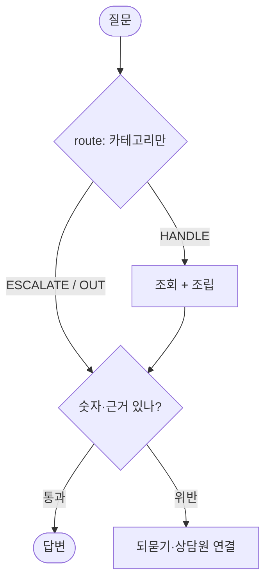

# 에이전트 몇개 돌려보고 업무팀을 나누며, 그 역량과 퀄리티를 못믿게 되는 점

> WRAP UP 0929 — 에이전트 팀 꾸리기
> 작성일: 2026-09-29 / @오재호

## 1. 이번 모듈에서 배운 것

- 에이전트에게 각각 업무 지시하는 방법과 워크플로우, 멀티 에이전트 구성하는 방법을 배웠다.
  근데 재밌는 점은 배우면서 오히려 반대로 배운 게 있다. 어떻게 지시하면 에이전트가 성능 저하되는지. 재촉하고 뭉뚱그려 진행하거나, 지시한 내용을 자체 생략하거나 확인 작업을 생략한다는 거다.

## 2. 키워드는 세 개만 남겼다

- langgraph, 딥리서치, 오케스트레이션. 말만 들으면 거창한데 뜯어보면 별 거 아니다.
  사이클 구조로 돌면서 누가 제어하고 누가 협업하고 결정하는 일이다. 예로 챗봇에 LLM이랑 RAG 붙여서 정확성 올리는 것도 같은 얘기다.
  똑똑하게 만드는 게 아니라 어떻게 구성되고 지시하냐에 따라 바보가 되거나 유용한 챗봇이 된다. 그리고 결국 정확한 DB가 중요하다.

## 3. 정리한 내용을 블로그 형식 작성

> 기록 방식은 이 글을 참고해서 내 사례에 맞게 응용했다. 내용은 다르다: https://chictimin.github.io/blog/did-my-feedback-break-the-agent-1/

### 나눌수록 못 믿을 데가 보였다

AI 모델별 에이전트 몇 개 돌려보니, 팀을 나눌수록 출력물 결과치를 못 믿겠더라. 사유는 간단하다. 컴퓨터 언어로 명확히 지시를 내가 못하는 거다.

에이전트 팀 꾸리기 전에는 나는 에이전트 하나 master에게 업무를 잘 시키는 게 다인 줄 알았다. 근데 이번에 챗봇 네 개를 돌리면서 생각이 바뀌었다. 나누면 편한 게 아니라, 나누니까 어디가 못 믿을지 결과가 보이더라. 사유는 지시와 워크플로우 구성 문제다.

내 애들은 이렇다. 부동산 라우팅은 질문 오면 `route → answer → guard`로 보낸다. 경매 / 시세 / 정비사업 / 규제 / 범위밖 다섯 갈래, 기본은 규칙이다. 식당은 정보 제공하고 RAG해서 브라우저에서 근거 찾고 로컬 Ollama가 답하고 뒤에 판정 결과를 붙인다. 법률 비서는 근거 없으면 답변 거절한다.

돌려놓고 보니 그림이 한 장으로 겹친다:

예로 부동산 경우 "래미안 전세 매물"이 있다. 처음에는 PRICE를 AUCTION보다 먼저 검사했더니 최저매각가격이 매매 시세로 오분류됐다. 순서를 뒤집고 전세/월세 패턴을 추가하니까 풀렸다. 코드 세 줄인데, 여기서 AI 본질을 봤다. 똑똑한 모델이 아니라 순서와 데이터 검색, DB 읽고 작동하는 구조의 경계 설정이 먼저다.

법률 비서 경우는 더 확실했다. 법조항 해석하고 판례 연결하면 사설 없이 답이 나온다. 근거 없으면 그냥 거절한다. 이게 답을 잘하는 것보다 중요하더라. 금액 하나, 조문 하나 지어내면 끝이니까.

그래서 요즘은 사고 나면 행동이랑 해석을 나눠 적는다:

| 본 행동 | 처음 해석 → 고친 것 |
|---|---|
| "래미안 전세" 오분류 | 모델이 멍청하다 → 순서가 잘못됐다, AUCTION 먼저로 |
| 약칭 "개포주공"에 되묻기만 반복 | DB가 비었다 → 약칭 매칭이 빠져서였다 |
| 예시 숫자 넣으니 가드레일 오탐 | 답이 틀렸다 → 예시 문구가 범인이었다 |

이렇게 적으니 재촉이 답이 아니라는 게 보인다. 뭉뚱그려 시키면 애가 확인을 생략한다. 급하면 조회 생략하고 지어낸다. 팀 꾸리기는 애를 늘리는 게 아니라 못 믿을 지점을 정하는 일이다. 분류-조립-검증 나누고, 증명 못 하면 보내고, 모르면 모른다고 하는 거. 그거면 된다.

---

### 참고한 내 프로젝트

- `CS service/matjip-routing-agent/agent.py`, `REPORT.md`
- `matjip/chatbot/README.md`, `PRD.md`
- `personal-lawyer-agent/README.md`
- `my-service-agent/README.md`
